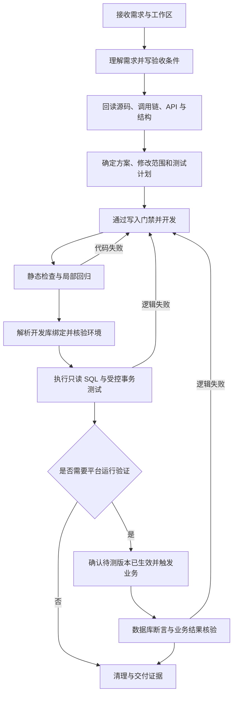

# 谷神需求开发与数据库测试工作流设计

版本：v1.0 · 2026-09-07

交付对象：后续负责实现工作流的 5.6 Sol

状态：待实现设计；本文不代表已有自动开发、数据库测试或平台发布能力。

> 2026-09-07 实施范围补充：用户已确认开发工作流存在，本次仅新增数据库测试工作流。最新开发范围、连接方式、工具选择与实施批次以[谷神数据库测试工作流开发补充方案](谷神数据库测试工作流开发补充方案.md)为准。本文保留作为整体流程及测试边界参考；其中重建开发流程、首版统一 workflow CLI、P0–P4 整体实施和第 12 节交接指令不再直接作为本次开发任务。首版采用 DBX MCP 只读测试，事务写入执行器按实际需要后续增加。

## 1. 目标与本次边界

建立一套可重复、可中断恢复的谷神开发流程：**理解需求 → 定位源码和调用链 → 明确验收条件 → 开发 → 根据实际代码确定开发数据库 → 分层测试 → 修正回归 → 交付证据**。

工作流应让 AI 按谷神规范完成开发，让执行器保证工作区、源码版本、数据库和测试范围一致。日常使用只需提供需求与明确的工作区；能够从配置、源码和已有授权确定的事项自动完成，只有影响正确性的歧义或缺失的写入授权才询问。

本次只新增设计文档，不修改业务源码、现有规则、数据库配置或工作流实现，不连接真实数据库，不创建新的模型任务，不进行提交、发布或安装。

### 1.1 首版实现形态

- **工作流指令与模板**：指导 AI 理解需求、读规范、定位源码、开发、编写用例和解释失败；可包装成 Skill，但核心流程不依赖特定模型。
- **统一 CLI 工作流执行器**：负责解析工作区、校验数据库映射、运行测试、记录状态和生成报告。安全边界由代码执行，不能仅靠提示词。
- **现有源码工具**：DATABASE 复用 Workcopy；SVN 复用受控读写、diff 和索引刷新。
- **平台测试入口**：首版允许人工发布与触发，工作流记录证据并继续数据库断言。后续有已核验接口时再自动化。

不建设通用 DAG 引擎、多个互相转发的 Agent 或独立数据库管理产品。先完成一个工作区内的一条开发闭环，再增加 UI。

## 2. 已核验现状及实现缺口

以下是本次本地源码和文档核验结果；后续实现开始时需检查变更，不能将函数位置视为永久契约。

| 能力 | 已有事实与入口 | 本方案处理 |
|---|---|---|
| 工作区 | `scripts/common/gusen_hub.py` 的 `resolve_workspace`、`workspace_summary`；显式 `workspaceKey` | 复用解析结果，不从目录名猜测 |
| 源码模式 | `context/source-mode.json`；CLI 的 `source-mode`、`workspace-summary` | 保存已解析的 `database` / `svn`，不修改 YAML 切换模式 |
| DATABASE 编辑 | readonly 上游镜像、workcopy 本地修改；差异保护 | 保留既有流程，不新增第二份源码基线 |
| SVN 编辑 | CLI `svn read/read-batch/write/write-batch`、Nexus 虚拟文档；独立编辑租约、hash、BASE、JSON Pointer 校验 | 单文件保存使用 `write`；多文件读取使用 `read-batch`，已知精确替换时由 `write-batch` 根据对象身份自动打开并写回，不直接改 checkout、不用临时脚本循环重试 |
| 定位和调用链 | 查询索引、`facts`、`explain`、`callers`；`source_facts.py` 标记 `runtimeTraceVerified=false` | 索引定位后回读源码，静态链不当作实际执行证据 |
| 数据库连接 | `gusen_hub.py:db_connect` 当前仅实现 MySQL；`resolve_datasource` 可解析配置名 | 首版自动执行仅承诺 MySQL，其他类型明确不支持 |
| 只读排查 | `run_source_diagnosis.py` 仅接受 `environment=test`、启用 diagnosis、query_only、数据库白名单；单条 SELECT、绑定参数、每步新只读事务 | 保持旧 `diagnose` 语义；其 PASS 只表示检查条件成立 |
| provider 限制 | `guthon_tool.py` 将 `diagnose` 列为 DATABASE-only | 新建独立测试能力，不绕过或放宽旧命令 |
| DBX | 当前会话工具暴露连接列表、schema 查询、SQL 查询及有状态 session；查询结果最多返回 100 行 | 可辅助人工排查；不是首版确定性测试执行器的硬依赖 |
| 平台版本 | 本地保存不等于平台运行；SVN 按物理 working copy 提交后仍有平台最终提交环节 | 单独核验待测对象的部署和运行证据 |

关键缺口：尚无“代码使用的数据源 → 对应开发连接”的专用测试绑定、开发库测试权限模型、业务断言执行器、发布版本核验及跨阶段状态记录。

### 2.1 与现有 SVN 规则的衔接

当前私有工作区规则禁止 SVN 分析因缺少数据而自动连接数据库或回退 provider。实施时须同步明确新增例外：

> 源码始终由原 provider 管理。仅在用户授权数据库测试、工作区配置独立测试绑定并通过环境核验后，允许在 SVN 模式执行独立的业务数据库测试；不得借此读取或回写源码数据库，不切换 provider，不扩大 SVN 授权范围。

这是一项**待实施的规则调整**。本文本身不修改或覆盖现行规则。Sol 若仅获得工具仓库实现授权，可完成执行器、模板和隔离测试；修改私有工作区规则需有对应授权，未生效前将该场景标记为受阻。

## 3. 贯穿全流程的身份与证据

每个任务绑定以下信息，任何一个关键值变化都需要重验相关阶段：

| 身份 | 内容 |
|---|---|
| 需求 | `taskId`、原始需求、验收条件 ID、需求版本 |
| 工作区 | 显式 `workspaceKey`、已解析 `sourceMode`、运行入口 descriptor |
| 源码 | 对象类型、对象 ID、运行时、源路径；SVN 另含 JSON Pointer、BASE、文件 hash |
| 范围 | 用户授权对象、允许修改的文件、开始时已有差异 |
| 数据路由 | 系统 ID、谷神数据源 ID、逻辑连接角色、路由证据 |
| 测试目标 | 显式 binding ID、环境、实际服务器身份、database/schema、租户 |
| 待测版本 | 本地变更摘要、平台运行版本证据、配置版本 |
| 执行 | `runId`、用例版本、数据范围、开始/结束时间、清理状态 |

同名表、相似连接名称或“连接成功”均不能证明目标正确。源码配置中的 datasource 也不必然是业务数据库连接。

## 4. 端到端工作流



图中任一步遇到环境缺失、权限不足、身份不明或结果不确定，记录具体阻碍；继续不依赖该步骤的工作。失败回路仅重新执行受影响检查。

### 阶段 A：理解需求

输入：用户需求、可用截图或文档、工作区标识、当前授权。

输出 `requirement.md`，至少包含：现状、目标行为、触发入口、业务对象与状态、影响范围、明确不处理项、验收条件、待确认问题。

每条验收条件采用“给定数据和状态 → 执行动作 → 预期结果”，覆盖正常、边界、拒绝条件及既有行为。必须区分代码缺陷、平台配置、数据状态和发布问题。简单需求使用简短模板，不强制长篇评审。

通过条件：影响实现的业务歧义已消除；不能通过默认值自行决定金额精度、租户隔离、取消语义或事务行为。

### 阶段 B：分析与方案

1. 从 runtime descriptor 和工作区摘要确定唯一工作区、provider 和工具能力。
2. 目标已知则直接回读；未知时有界查询。仅在共享方法或跨对象影响时扩大调用方调查。
3. 按目标运行时读取谷神基线、模式文档和实际用到的 API 签名；GSS、Velocity 和页面 JS 分别处理。
4. 记录“入口 → 条件分支 → 方法调用 → 数据读写 → 副作用”的相关路径，明确动态调用和未能解析的路径。
5. 从代码和配置提取表、视图、字段、业务键、租户、数据源选择、事务、临时表、异步任务及外部接口。
6. 形成 `analysis.md`：原因、实现方案、授权文件列表、调用方影响、数据路由证据、测试矩阵。

分析阶段可先完成数据库绑定候选解析；实时结构核验在访问授权和绑定明确后执行。若结构事实影响实现，必须在对应代码修改前完成核验，不能推迟到测试后补猜。

### 阶段 C：开发

首次修改遵守私有工作区现有代码写入门禁，并记录实际核验依据。保存开始时的用户差异清单，避免将其作为本次变更或回滚对象。

- DATABASE：通过现有工具准备 workcopy，对照 readonly 与已有修改；不改 readonly 或管理元数据。
- SVN：有效读写会话编辑对应对象片段；会话过期、hash/BASE 变化或外部修改时回读并重新评估，不强制覆盖。
- 共享逻辑在授权调用链的职责入口解决，不新增无需求的兼容分支。
- 本地保存后生成变更摘要、检查物理 diff；SVN 对变更文件执行定向索引刷新。
- 不自动暂存后续改动、不自动提交或发布。现有工具首次创建 workcopy 的既定行为保持原契约。

产物：实际代码变更、`changes.md`、绑定验收条件的 `test-plan.json`。

### 阶段 D：数据库和平台测试

执行顺序为静态检查、目标核验、只读检查、必要的受控写入测试、必要的平台集成验证。不同用例可只要求其中部分层级，但必须预先说明覆盖能力。

源码、测试计划或平台版本变化后，旧结果保留为历史，不能继续作为当前版本通过证据。

### 阶段 E：修正与交付

失败归类为实现缺陷、测试数据不足、结构漂移、环境/权限问题、发布不一致、并发干扰或外部依赖问题。先确认原因再修改，不因失败自动放宽断言或补造预期结果。

交付：修改概要、需求覆盖表、实际测试目标的脱敏标识、逐层结果、待处理阻碍、清理结果及保留的用户改动。未运行的层级必须明确列出。

## 5. 如何从代码选择对应开发数据库

### 5.1 显式绑定模型

新增私有配置 `<运行数据 home>/config/workflow-testing.yaml`，公开仓库只提供 `config/example/workflow-testing.example.yaml`。以下为**拟新增字段**，当前工具尚不支持：

```yaml
schemaVersion: 1
workspaces:
  products.demo-product:
    bindings:
      - id: trade-dev
        systemId: SYS-DEMO
        dataSourceId: DS-DEMO
        role: business
        environment: development
        datasourceRef: demo-business-dev
        allowedDatabases: [demo_trade]
        defaultDatabase: demo_trade
        expectedIdentityRef: demo-dev-identity
        allowedTenants: [demo-tenant]
        permissions:
          read: true
          transactionTest: false
          platformTest: false
        allowedTables: [DEMO_ORDER, DEMO_ORDER_DETAIL]
        limits:
          queryTimeoutSeconds: 30
          maxReturnedRows: 100
          maxAffectedRows: 20
```

`datasourceRef` 引用现有凭据解析，不保存密码副本；`expectedIdentityRef` 指向私有的服务器、数据库及平台环境核验资料，不只是“dev”标签。配置只表示能力上限，本次任务的授权范围还需单独匹配，不能因布尔值为 true 就获得全部写权限。

默认权限只读。首版环境限定为显式 development 或 test，生产环境不纳入本工作流。首版 MySQL 不单独引入 schema 路由，database 即库；后续数据库适配器需明确 schema 语义。

### 5.2 解析规则

1. 从目标对象及实际调用链提取 `systemId`、`dataSourceId`、显式数据库选择参数、连接角色和租户来源。字段来源随平台对象核验，不假设每个对象均直接携带这些字段。
2. 静态证据指向唯一 binding 时自动选择；无匹配时报告 `BINDING_MISSING`，多个匹配时报告 `BINDING_AMBIGUOUS`，不选第一个。
3. 动态路由由具体用例输入和当前平台配置求值，并保存证据；仍无法确定时停止该用例的数据库操作。
4. 同一函数跨业务库、基础库时按步骤明确 binding 和 database；跨库 SQL 中每个库都必须在授权集合中。不能因默认库合规就放行 SQL 内的其他库。
5. 连接后核验实际 database、服务器身份、版本、会话时区及必要的租户条件；使用项目提供的环境身份依据。资料不足则不能宣称核验通过。
6. 读取命中表的实时字段、类型、主键、索引以及事务引擎等必要信息，与代码引用对照。结构不一致先报告，不自动改表适配。
7. 固化解析后的绑定摘要；配置、服务器或路由变化后，旧授权和证据必须重新匹配。

不能按表名前缀、目录 PRD/PRJ、连接名称含“开发”或上次使用的数据库做隐式回退。缺少映射时用户只需补关键绑定信息，不要求重复提供已有配置。

## 6. 测试层级与执行语义

| 层级 | 测什么 | 能证明什么 | 不能证明什么 |
|---|---|---|---|
| L0 静态 | 方言、API、diff、调用方、局部测试 | 源码符合已检查规则 | 平台能实际执行 |
| L1 只读数据库 | 实时结构、入口条件、查询/汇总结果、业务不变量 | 该库该数据下的查询和条件 | 修改后的函数已运行 |
| L2 事务测试 | 可隔离的 DML、临时表、数据库规则 | 同一数据库事务中的 SQL 行为 | 平台权限、事件或应用事务一致性 |
| L3 平台集成 | 待测代码实际发布后，经真实入口执行并查结果 | 已核验路径的业务运行结果 | 未覆盖的入口及环境 |

后端 GSS、服务组件、页面操作、事件调度和外部接口行为通常需要 L3。仅调整可独立核验的只读查询时，需求验收可以指定 L0+L1；不能为了省略发布而擅自降低需要的层级。

### 6.1 用例由需求和代码共同生成

每个用例必须包含：`caseId`、`requirementIds`、覆盖的源码分支、`level`、binding、输入参数、前置条件、执行动作、断言、清理方案、超时和证据路径。

断言支持预定义类型：结果集合相等、标量/计数相等、数值容差、行不存在、状态迁移、汇总一致、无重复、无越权变化。禁止执行任意断言代码；金额和数量按项目精度使用十进制定点语义，不用浮点比较代替业务规则。

每次代码变更检查受影响的 WHERE 条件、JOIN、聚合、空值、排序、幂等、取消/重试、事务和权限。预期结果来自验收条件或独立人工推导，不能直接用被测 SQL 算一遍当期望值。

动态 GSS 生成 SQL 时，记录生成上下文、实际 SQL 和绑定参数。不得简单字符串替换 `#{...}` / `:...` 模拟平台表达式、权限注入或临时表逻辑；无可靠生成入口则仅生成待平台验证的用例。

### 6.2 L1：只读检查

使用只读账号和数据库支持的只读事务；限定表、库、返回量和服务端可用的执行超时。结果截断必须记录，不能把截断的明细当完整集合断言；必要时用单独的 COUNT/聚合和精确主键查询。

SQL 参数走驱动绑定；标识符只能来自已校验的配置和结构白名单。SQL 检查不能只判断开头是 SELECT，要处理多语句、存储函数、副作用、锁、跨库引用与注释等情况。首版仅支持可证明安全的语句集合，不认识的语法报告不支持。

旧诊断器的每步独立事务不保证多步同一快照。需要一致性快照的用例由新执行器在同一连接、同一只读事务执行；观察平台异步完成时则开启新读事务，避免一直读取旧快照。

### 6.3 L2：同连接事务测试

仅用于用户授权的开发/测试库、限定表与可回滚操作。执行器必须确认相关表使用事务引擎，排除未知触发器副作用、隐式提交、存储过程和外部调用。DDL 不属于通用自动事务测试。

流程：获取测试资源锁 → 开启同一连接事务 → 准备带 runId 的隔离数据 → 执行被测 SQL → 断言 → `finally` 中 ROLLBACK → 校验残留 → 释放资源。

允许插入自有测试记录；修改已有记录必须明确主键集合、前镜像及并发条件。影响行数超限即失败并回滚；回滚不能替代正确的前置作用域校验。跨连接、非事务表、隐式提交和外部副作用均不能声称由该事务清理。

数据库计数器等非回滚状态需在用例中声明；不允许恢复的环境直接拒绝相应用例。连接中断时独立核验残留，不仅依赖“通常会自动回滚”。

### 6.4 L3：平台运行与持久化测试数据

平台连接无法看到另一未提交事务中的夹具，因此 L3 不能复用“准备数据后总回滚”的承诺。

1. 核对平台环境、入口、租户及该入口实际使用的业务数据库。
2. 记录本地变更摘要和平台待测对象的版本依据。优先使用可靠版本/hash；平台不支持时保存对象回读、发布时间和实际执行证据，并标明证据强度。仅口头称已发布不足以记为自动版本校验通过。
3. 需要提交源码或平台发布时，按已有授权执行；无授权则生成明确的对象清单和发布步骤，等待人工完成。不通过数据库 UPDATE 平台源码表实现部署。
4. 使用隔离租户/业务批次和明确主键准备已授权的持久化夹具，记录所有新增记录及必要前镜像。
5. 通过已核验的页面/API/调度入口触发；记录关联 ID、输入、运行版本和日志证据。接口不可用时支持人工触发并补证据。
6. 按业务键在限定期限内观察最终状态；调度型用例有明确轮询间隔和截止时间。不自动重复触发非幂等业务。
7. 执行数据库断言并清理。优先使用平台支持的取消/删除动作；直接 SQL 清理仅在已授权、无额外业务副作用且记录仍归本 run 所有时执行。

共享记录已被他人修改时禁止直接覆盖前镜像。清理失败记为 `CLEANUP_REQUIRED`，交付精确残留清单和修复建议，不能标记完整通过。涉及邮件、支付或真实外部消息等副作用，需有效测试替身或专门测试目标后才能执行相关用例。

## 7. 状态、授权与恢复

### 7.1 最小状态模型

任务状态：`DRAFT → ANALYZED → IMPLEMENTED → TESTING → VERIFIED`；中途可为 `BLOCKED`、`FAILED`、`CLEANUP_REQUIRED`。每阶段独立保存 `PENDING/RUNNING/PASS/FAIL/BLOCKED/SKIPPED`，避免一个 PASS 覆盖所有验证层。

`VERIFIED` 要求所有必需验收条件通过、版本身份一致、清理完成。报告已生成但仍缺 L3 时只能记“已交付，验证未完成”。

任务记录：需求和计划摘要、源码摘要、binding 摘要、用例版本、平台版本、授权依据、执行中操作、证据、错误分类、清理结果。敏感参数和结果只留在私有路径，终端默认显示脱敏摘要。

### 7.2 不反复确认，但不能扩大授权

用户明确要求开发，涵盖相关本地修改与非破坏性验证。数据库测试的读写权限按用户已有授权和绑定上限共同确定；写入范围明确授权一次后，范围和版本未变化无需逐条 SQL 询问。

写入许可绑定 workspace、环境身份、库表、业务数据范围、用例/动作摘要及清理方案。变更这些内容后重新评估已有授权，不能以先前任意开发请求概括授权 DDL、发布或共享数据覆盖。

只读验证、分析和用例生成不因等待平台发布而停下。必需的确认应提供已完成的具体动作清单及原因。

### 7.3 中断和并发

- 状态文件原子替换，并在持久化写入动作前记录执行意图。恢复时核对源码、绑定、平台版本及实际数据，不只读取上次阶段号。
- 只读查询可按有限次数重试；写入或平台触发在结果不确定时先查业务键/关联 ID，禁止盲目重放。
- 测试锁按实际数据库和数据范围建立；同一数据库被不同 workspace 引用时仍检测冲突。多库锁按固定顺序获取，避免死锁。
- 本地锁只能阻止本机执行器冲突，不能约束同事或外部平台；共享环境需独立测试范围和数据库条件保护。
- 复用既有 SVN 操作锁，不在等待数据库测试或人工发布时长时间持有源码操作锁。

## 8. 实现结构与接口草案

下列路径和命令均为**拟新增设计**，不是当前可执行能力。首版保持模块数量少，明确职责后再拆分。

| 位置 | 职责 |
|---|---|
| `scripts/guthon_tool.py` | 注册 workflow 子命令；复用 home/workspace 解析 |
| `scripts/common/workflow.py` | 阶段编排、状态/证据、授权范围校验、报告 |
| `scripts/common/workflow_testing.py` | 测试绑定解析、SQL 校验、执行与断言、清理 |
| `scripts/common/gusen_hub.py` | 仅复用或必要扩展工作区/凭据解析，不堆入测试业务 |
| `config/example/workflow-testing.example.yaml` | 脱敏绑定模板 |
| `docs/workflows/gushen-development/` | 工作流指令、需求/分析模板、用例 schema 与交付模板 |
| `tests/` | 本地 Python 测试和临时数据库夹具；按仓库规则不提交 |

如需 Skill 包装，后续实现时使用 Skill 创建规范，将上述流程作为唯一来源，避免复制另一套规则。首版不修改 Nexus/Bridge UI；之后 UI 只调用同一 CLI，不各自实现路由或权限。

拟定命令：

```text
<descriptor.command> workflow --home <descriptor.home> --workspace products.demo-product -- init --task <taskId>
<descriptor.command> workflow --home <descriptor.home> --workspace products.demo-product -- inspect --task <taskId>
<descriptor.command> workflow --home <descriptor.home> --workspace products.demo-product -- plan-test --task <taskId>
<descriptor.command> workflow --home <descriptor.home> --workspace products.demo-product -- test --task <taskId> --level L1
<descriptor.command> workflow --home <descriptor.home> --workspace products.demo-product -- resume --task <taskId>
<descriptor.command> workflow --home <descriptor.home> --workspace products.demo-product -- report --task <taskId>
```

`descriptor.command` 为参数数组语义，按工具既有方式执行，不将字符串拼接交给 shell。`plan-test` 仅验证/物化 AI 已依据需求和代码编写的测试计划，不承诺 CLI 自动理解任意业务代码。`inspect` 默认不访问数据库。

建议统一返回：`schemaVersion/taskId/runId/workspaceKey/phase/status/errorCode/evidencePaths/nextAction`。错误码至少包含 `BINDING_MISSING`、`BINDING_AMBIGUOUS`、`ENVIRONMENT_MISMATCH`、`SCHEMA_DRIFT`、`VERSION_UNVERIFIED`、`PERMISSION_REQUIRED`、`UNSUPPORTED`、`ASSERTION_FAILED`、`CLEANUP_REQUIRED`。失败和受阻均使用非零退出码，结构化状态区分原因。

任务产物建议位于解析后的 `<workspace.root>/context/workflows/<taskId>/`，其中包含 `requirement.md`、`analysis.md`、`changes.md`、`test-plan.json`、`state.json` 和 `runs/<runId>/report.md`。运行明细、夹具、SQL 参数和日志禁止自动暂存；实现时检查现有 auto-add 入口并显式排除 workflow 运行产物。目录必须在解析后的私有工作区内，拒绝路径穿越和符号链接逃逸。

### 8.1 DBX 的定位

DBX 可用于已授权目标的连接发现和结构查看，connection ID 只保存在私有绑定中。当前公开工具参数没有驱动式绑定参数接口，不将 DBX 原生 SQL 字符串调用直接用作自动写入测试执行器。

DBX 有状态 session 可保留临时表和会话变量，但工具描述不足以证明所有事务/取消语义；接入自动测试前需专项验证。会话空闲 30 分钟会过期，测试清理不能依赖会话无限存活，也不能把关闭 session 视为已核验回滚。

首版走现有 MySQL 驱动和显式事务，便于可重复测试；不会静默在 DBX 与 CLI 连接间切换。

## 9. 交给 Sol 的开发顺序

| 批次 | 实现内容 | 验收与交付 |
|---|---|---|
| P0 契约与模板 | 重读当前规则和源码；工作流说明、需求/分析/用例模板、配置 schema；落实 SVN 独立测试规则衔接 | 模板示例可校验；现有业务源码和连接不变 |
| P1 只读闭环 | workflow CLI、状态/报告、唯一 binding 解析、MySQL L1 与精确断言 | 在隔离 MySQL 验证；DATABASE/SVN 均不切换源码 provider；旧 diagnose 不变 |
| P2 开发闭环 | 接入源码证据、变更摘要、写入门禁记录、定向回归和恢复 | DATABASE 差异保护、SVN 会话失效、未授权文件保护均有证据 |
| P3 写入测试 | L2 同连接事务、数据范围限制、失败回滚与残留检查 | 真实隔离数据库验证，不以 mock 代替回滚证明 |
| P4 平台闭环 | L3 人工发布/触发衔接、版本证据、持久夹具清理 | 一个用户选定的真实开发环境场景贯通；有授权后再执行 |
| P5 可选增强 | 已核验平台 API 自动触发、DBX 适配、Nexus 工作流入口 | 按实际改动补 UI、安装和端到端验证 |

P1 是首个可用里程碑，不等于完整业务测试闭环。用户要求的完整流程至少包含 P0–P4；缺少平台接口时 P4 使用人工动作衔接，不能省略版本和结果核验。

Sol 每批只修改已授权范围，先检查已有 diff；涉及现有功能的行为或配置变化，同步 README、配置说明、相关 Bridge/Nexus 文档和两份 HTML 手册。只有交付安装验证时才打包，不为设计阶段重建产物。

## 10. 工作流自身的验收清单

| 场景 | 必须结果 |
|---|---|
| 一个明确工作区与唯一绑定 | 自动解析；不重复询问已知信息 |
| 工作区缺失、多绑定、动态路由未定 | 拒绝数据库执行，返回具体缺项；可继续分析 |
| 连接名称正确但实际库/服务器不符 | 环境核验失败，不执行测试 SQL |
| SVN 未配置独立测试能力 | 不调用旧 diagnose，不回退 DATABASE |
| 修改代码后复用旧报告 | 报告标记过期，必需验证重新执行 |
| 表结构与本地资料不一致 | 报告漂移，不自动 DDL |
| 跨库引用或未授权表 | 执行前拒绝 |
| 非 SELECT、副作用函数、多语句或未知 SQL | L1 拒绝或标记不支持，不通过字符串兜底 |
| 结果超过返回上限 | 标记截断，完整集合断言不能 PASS |
| L2 任一步异常/行数超限/中断 | 尝试回滚并核验残留，结果明确 |
| 非事务表或隐式提交操作 | 不进入通用 L2 自动测试 |
| 平台仍运行旧代码 | L3 不可通过，即使查询结果碰巧正确 |
| L3 异步延迟 | 有界等待新快照；超时保留关联 ID，不重复触发 |
| 清理记录被并发修改 | 不覆盖，CLEANUP_REQUIRED |
| 同库不同 workspace 并发测试 | 检测数据范围冲突，避免重复执行 |
| 测试计划/绑定/授权范围变化后恢复 | 重验受影响阶段；不重放结果不确定的写入 |
| 无关用户修改和测试运行产物 | 不覆盖、不自动暂存、不混入提交 |
| 数据库或平台不可用 | 如实报告受阻层级，不伪造通过 |

验证顺序：本地单元测试 → 隔离 MySQL 集成测试 → 用户授权的开发环境试点 → 如涉及 UI 再安装验证。针对新增测试模块使用 `tests/`；按影响选择 workspace routing、CLI self-test、Bridge/Nexus 测试，不重复跑输入未变且已通过的检查。

## 11. 通用业务示例

需求：“订单明细为空时拒绝确认；有效明细金额汇总正确；重复确认不重复生成下游记录。”本例仅用于说明流程，不代表实际谷神对象或表。

1. 理解需求：明确空明细、无效明细、金额精度和重复确认的预期，给出 AC-01/02/03。
2. 定位：回读确认入口、汇总函数、下游生成函数与数据源选择代码，核验实际 API。
3. 开发：在正确职责入口调整；记录目标对象和源码摘要。
4. 绑定：用对象系统/数据源及运行配置匹配 trade-dev，核验开发库身份、租户和结构。
5. L1：核验输入状态和查询汇总；预期金额来自独立样例，不复制被测公式。
6. L2：仅当存在可独立验证的受控 SQL 时执行，不强行将平台函数改写成 SQL 模拟。
7. L3：确认新版本生效后，通过确认入口分别运行空明细、有效明细及重复操作，断言错误响应、汇总值、下游记录数量和未越权修改。
8. 清理并交付：记录验收覆盖、实际运行版本、数据库断言和残留检查。若只完成第 5 步，报告“只读数据库检查已完成，业务确认流程尚未验证”。

## 12. 可直接交给 Sol 的任务说明

> 按本文实现谷神需求开发与数据库测试工作流，依次完成 P0–P4。先重读当前 AGENTS、工作区/provider、CLI、Workcopy/SVN 读写和数据库排查实现，检查已有修改；以当前源码为准修正已漂移的设计。首版采用工作流指令与模板加 CLI 执行器，复用工作区和凭据解析，保持旧 diagnose 语义。数据库绑定独立于源码 provider，禁止隐式回退。先在隔离环境完成 L1，再实现受控 L2，以及带运行版本证据和清理的 L3。私有规则修改、真实数据库写入及平台发布须具有对应授权；有阻碍时继续独立工作并明确缺项。不要自动提交、发布、修改无关业务源码或暂存运行产物。按批次交付实现、充分测试证据和剩余验证边界。

首次真实试点需要补齐：唯一 workspaceKey、目标需求/对象、开发数据库 binding、可靠环境身份资料、测试租户/数据范围、平台发布与触发方式，以及实际读写授权。工具实现和隔离验证不依赖提前获得生产或私有业务数据。

## 13. 核验依据与本文验证范围

- [工具仓库规则](../AGENTS.md)：职责、工作区、provider、验证与公开/私有边界。
- [项目说明](../README.md)：源码工作流、发布边界及只读排查能力。
- [配置说明](../config/README.md)：数据源、源码模式与 diagnosis 限制。
- [数据源模板](../config/example/datasource.example.yaml)、[诊断模板](../config/example/source-diagnosis.example.json)：现有配置契约。
- [CLI](../scripts/guthon_tool.py)：工作区命令、SVN 入口、DATABASE-only diagnose。
- [共享工作区实现](../scripts/common/gusen_hub.py)：工作区摘要、连接、凭据引用与 Workcopy。
- [只读诊断执行器](../scripts/providers/database/run_source_diagnosis.py)：SQL 限制、事务、报告和退出状态。
- [静态事实实现](../scripts/common/source_facts.py)：运行时证据标记。
- [Nexus 说明](../plugins/GuthonVSCodeExtension/gushen-vscode-completion/README.md)：SVN 保存和平台最终提交边界。

另只读核验了私有工作区 AGENTS 的规则入口，并查看当前会话 DBX 工具契约；未读取业务源码、真实连接配置或业务记录，本文不包含其内容。本文只做设计、引用和差异检查，没有执行数据库测试、平台验证或工作流代码测试。
